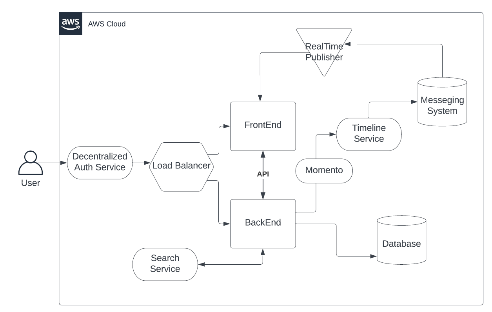
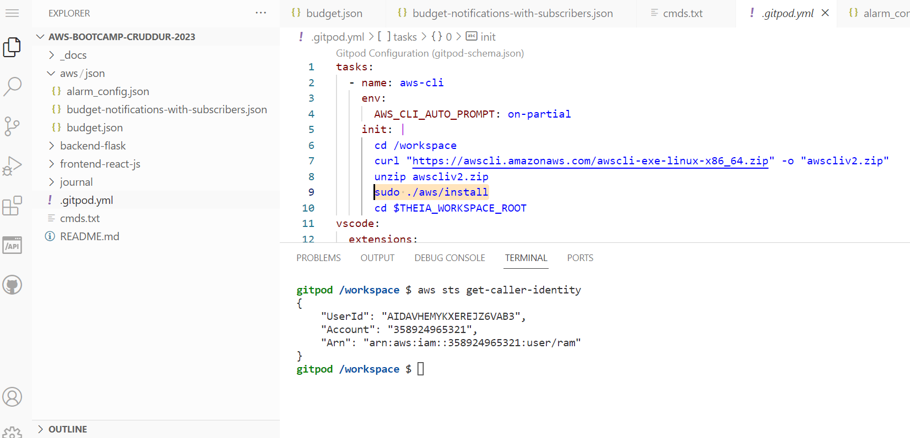
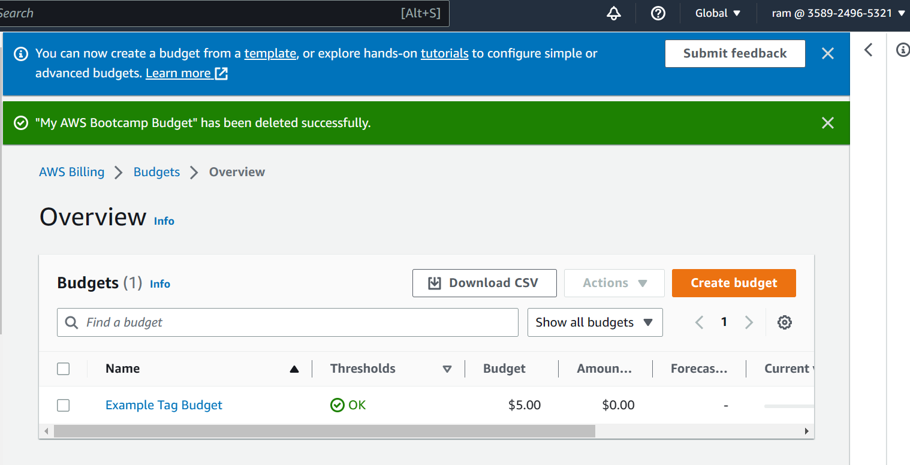
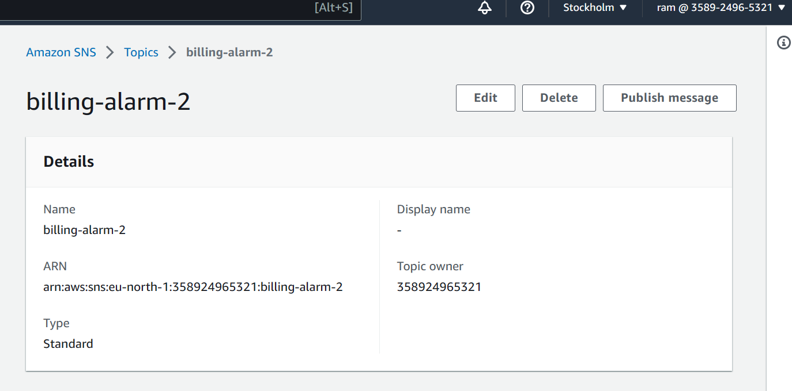
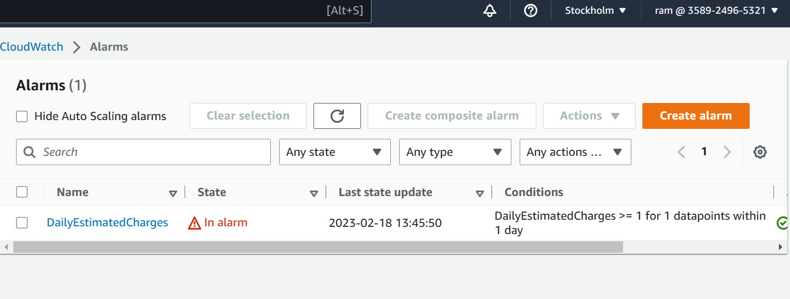

# Week 0 — Billing and Architecture

## Required HomeWork

### Watched the live stream and created the Conceptual Architecture Diagram.

[Conceptual Architecture Diagram](https://lucid.app/lucidchart/1fcb1ee9-fb19-41b4-a367-d19d0baba017/edit?viewport_loc=-430%2C-262%2C1796%2C670%2C0_0&invitationId=inv_1ef9aa14-afb8-4e8a-a467-806167a631f0)



### Recreated the Logical Architecture Diagram.

[Logical Architecture Diagram](https://lucid.app/lucidchart/a95c9c91-9e6f-4040-9ce8-7447a447e310/edit?viewport_loc=-241%2C311%2C2048%2C764%2C0_0&invitationId=inv_395b8739-9d0c-45f9-acf7-b48a76681f2c)


### Installed AWS CLI to the gitpod and performed below tasks

 1. Updated .gitpod.yml file
 2. Created aws/jason dir and added three json files (alarm-config, budget-notification, budget)
 
 **Below commands were ran**
 ```
 aws budgets create-budget \
    --account-id $AWS_ACCOUNT_ID \
    --budget file://aws/json/budget.json \
    --notifications-with-subscribers file://aws/json/budget-notifications-with-subscribers.json

aws sns subscribe \
    --topic-arn="arn:aws:sns:eu-north-1:358924965321:billing-alarm-2" \
    --protocol=email \
    --notification-endpoint=th----.-t@gmail.com

aws cloudwatch put-metric-alarm --cli-input-json file://aws/json/alarm_config.json

aws configure
gp env AWS_Access_Key_ID=
gp env AWS_Secret_Access_Key=
gp env AWS_DEFAULT_REGION=eu-north-1
export AWS_ACCOUNT_ID=$(aws sts get-caller-identity --query Account --output text)
env | grep AWS
 ```



  ### Using aws cli and json files,
  
  - Created AWS budget
  
  - Created SNS topic and configured my email to receive email alerts
  
  - Created a Cloud Watch alarm
  
  
 **I have created an IAM admin user named "ram" for all my performed tasks**
 
 3. Committed all the tasks to the repo.
